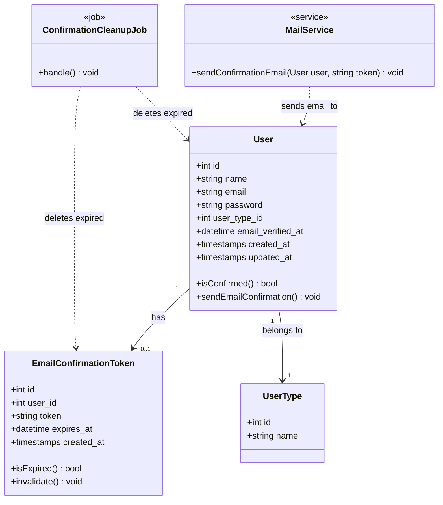
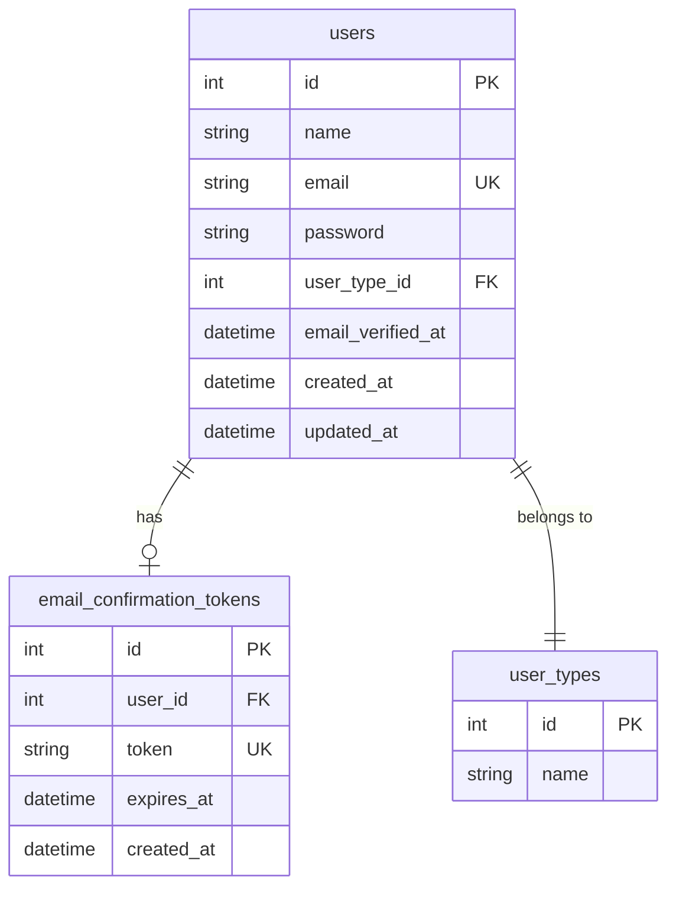
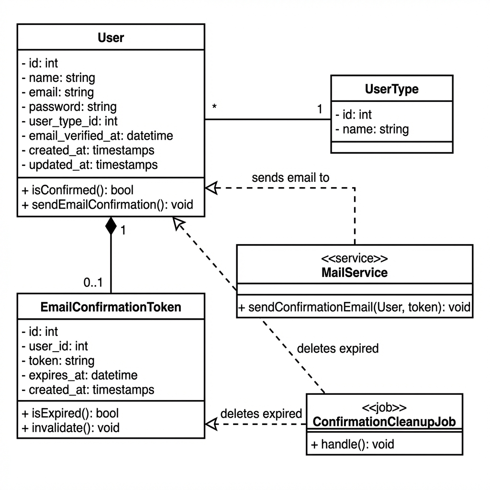
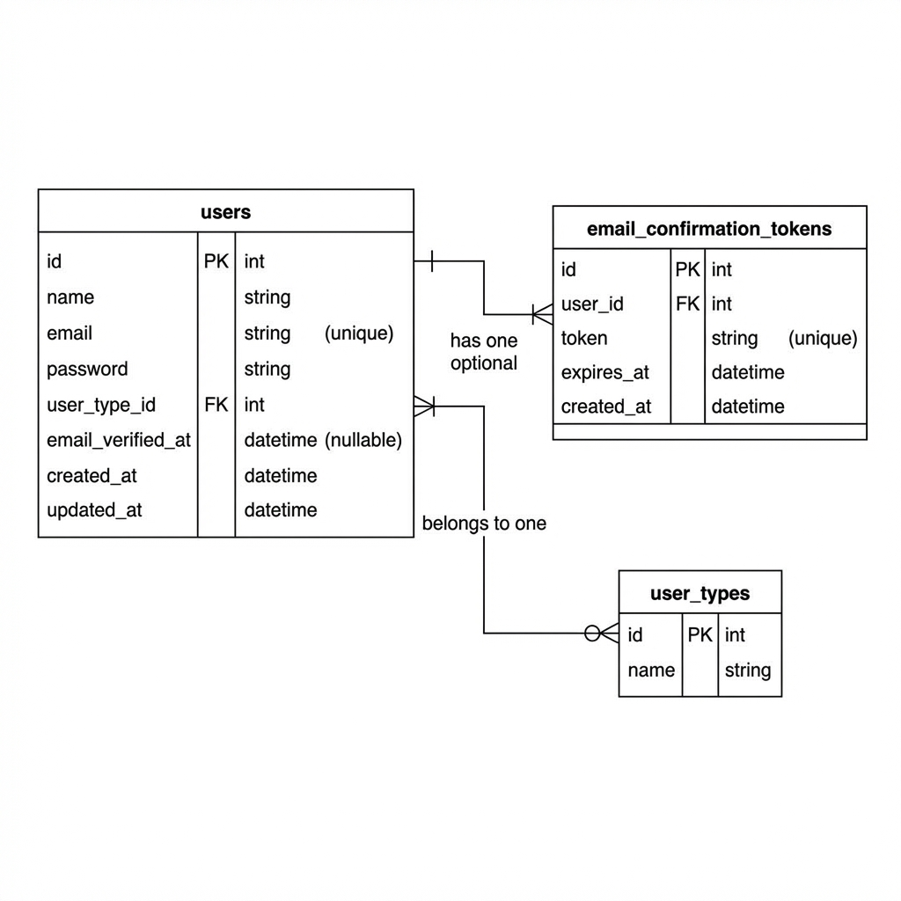

# Estória de Usuário: RF_B1 - Confirmação de E-mail no Cadastro

## Estória (Formato Gherkin)

> **Como** um novo usuário do sistema,  
> **Quero** receber um e-mail de confirmação após me cadastrar,  
> **Para** ativar minha conta e ter acesso completo às funcionalidades do sistema.

---

## Especificação do Requisito

### Descrição Geral
O sistema deve enviar um e-mail de confirmação imediatamente após o cadastro de um novo usuário. Enquanto o e-mail não for confirmado, o usuário terá acesso limitado (equivalente a um visitante). O link de confirmação expira em **15 minutos**. Se não for confirmado nesse período, o cadastro incompleto é **automaticamente excluído** do banco de dados.

### Regras de Negócio

| ID | Regra |
|----|-------|
| RN01 | O e-mail de confirmação deve ser enviado imediatamente após o formulário de cadastro ser submetido com sucesso. |
| RN02 | O link de confirmação deve conter um token único (UUID ou hash) associado ao usuário. |
| RN03 | O token de confirmação expira em **15 minutos** a partir da criação. |
| RN04 | Se o token expirar sem confirmação, o registro do usuário deve ser **excluído automaticamente** do banco de dados. |
| RN05 | Ao clicar no link válido, o usuário é autenticado automaticamente e redirecionado ao Dashboard com uma mensagem de sucesso: *"Cadastro confirmado com sucesso!"*. |
| RN06 | Antes da confirmação, o usuário só pode acessar a página inicial pública e a listagem de eventos (igual a um visitante não logado). |
| RN07 | Se um usuário não confirmado tentar fazer login, o sistema exibe: *"Seu e-mail ainda não foi confirmado."* com opção de **Reenviar link de confirmação**. |
| RN08 | O reenvio de e-mail gera um **novo token** e reinicia a contagem de 15 minutos. O token anterior é invalidado. |

### Critérios de Aceite (Gherkin - Cenários)

```gherkin
Funcionalidade: Confirmação de E-mail no Cadastro

  Cenário: Cadastro bem-sucedido dispara e-mail
    Dado que o visitante preencheu o formulário de cadastro corretamente
    Quando ele submeter o formulário
    Então o sistema deve criar o usuário com status "não confirmado"
    E enviar um e-mail para o endereço informado contendo o link de confirmação
    E exibir a mensagem "Verifique seu e-mail para ativar sua conta."

  Cenário: Confirmação de e-mail dentro do prazo
    Dado que o usuário recebeu o e-mail de confirmação
    E o link ainda está dentro do prazo de 15 minutos
    Quando ele clicar no link de confirmação
    Então o sistema deve atualizar o status do usuário para "confirmado"
    E autenticar o usuário automaticamente (fazer login)
    E redirecioná-lo para o Dashboard
    E exibir a mensagem "Cadastro confirmado com sucesso!"

  Cenário: Link de confirmação expirado
    Dado que o usuário recebeu o e-mail de confirmação
    E o prazo de 15 minutos já expirou
    Quando ele clicar no link
    Então o sistema deve exibir a mensagem "Este link expirou. Por favor, realize o cadastro novamente."
    E o registro do usuário deve ter sido removido do banco de dados

  Cenário: Tentativa de login sem confirmação
    Dado que o usuário cadastrou-se mas não confirmou o e-mail
    Quando ele tentar fazer login com suas credenciais
    Então o sistema deve impedir o acesso
    E exibir a mensagem "Seu e-mail ainda não foi confirmado."
    E exibir o botão "Reenviar link de confirmação"

  Cenário: Reenvio de link de confirmação
    Dado que o usuário está na tela de "e-mail não confirmado"
    Quando ele clicar em "Reenviar link de confirmação"
    Então o sistema deve gerar um novo token de confirmação
    E invalidar o token anterior
    E enviar um novo e-mail com o link atualizado
    E exibir a mensagem "Um novo link foi enviado para seu e-mail."
```

### Fluxo Principal
```
[Visitante] -> [Preenche Formulário] -> [Sistema cria User (não confirmado)]
                                            |
                                            v
                                     [Envia E-mail com Link]
                                            |
                                            v
                          [Usuário clica no link em até 15 min]
                                            |
                                            v
                                    [Confirma e faz Login]
                                            |
                                            v
                                       [Dashboard]
```

### Fluxo Alternativo (Expiração)
```
[Link Expirado após 15 min]
         |
         v
[Job/Scheduler deleta usuário não confirmado]
         |
         v
[Usuário tenta usar link] -> [Erro: "Link expirado, refaça o cadastro."]
```

---

## Diagrama de Classe do Contexto (UML)



---

## Diagrama ER do Contexto (Entidade-Relacionamento)



---

## Dependências Técnicas

| Componente | Tecnologia/Recurso |
|------------|-------------------|
| Envio de E-mail | Laravel Mail + SMTP (Mailtrap configurado) |
| Token | `Str::uuid()` ou `hash('sha256', ...)` |
| Scheduler | Laravel Task Scheduling (`schedule:run`) |
| Job de Limpeza | `php artisan make:command CleanupUnconfirmedUsers` |

---

## Observações e Sugestões

1. **UX**: Enquanto o e-mail não é confirmado, exibir um banner sutil no topo da página pública: *"Confirme seu e-mail para acessar todas as funcionalidades."*

2. **Segurança**: O token deve ser hasheado no banco (guardar apenas o hash). O link enviado contém o token original, e na validação comparamos os hashes.

3. **Logs**: Registrar eventos de confirmação bem-sucedida e falhas (para auditoria e debug).

---

## Anexos - Diagramas em PNG

### Diagrama de Classe UML


### Diagrama ER (Banco de Dados)

