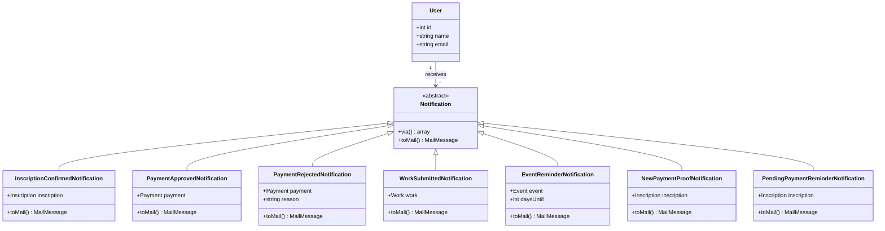
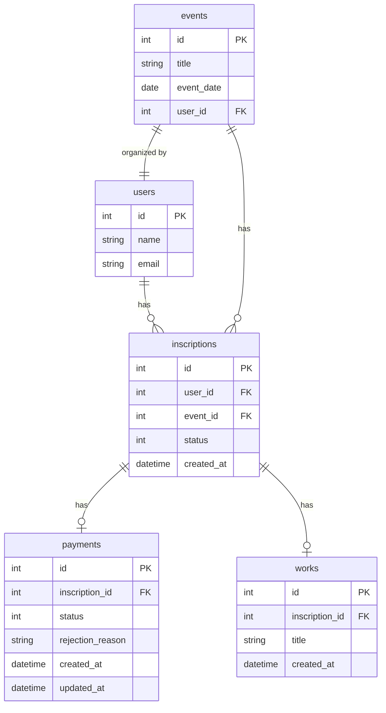

# Estória de Usuário: RF_S6 - Notificações Automáticas por E-mail

## Estória (Formato Gherkin)

> **Como** usuário do sistema (Participante ou Organizador),  
> **Quero** receber notificações por e-mail sobre eventos importantes,  
> **Para** acompanhar o status das minhas inscrições, pagamentos e não perder prazos.

---

## Especificação do Requisito

### Descrição Geral
O sistema deve enviar e-mails automáticos em momentos-chave do fluxo de uso, mantendo participantes e organizadores informados sobre ações pendentes, confirmações e lembretes de prazo.

---

## Notificações para o PARTICIPANTE

| ID | Gatilho | Assunto do E-mail | Conteúdo |
|----|---------|-------------------|----------|
| N01 | Inscrição realizada | "Inscrição Confirmada - {Evento}" | Dados da inscrição, tipo escolhido, instruções de pagamento |
| N02 | Pagamento aprovado | "Pagamento Aprovado - {Evento}" | Confirmação, status atualizado, próximos passos |
| N03 | Pagamento recusado | "Pagamento Recusado - {Evento}" | Motivo da recusa, link para reenviar comprovante |
| N04 | Trabalho submetido | "Trabalho Recebido - {Evento}" | Confirmação de recebimento, título do trabalho |
| N05 | Lembrete 7 dias | "Faltam 7 dias para {Evento}" | Detalhes do evento, atividades inscritas |
| N06 | Lembrete 1 dia | "Amanhã: {Evento}" | Detalhes do evento, local, horário |

---

## Notificações para o ORGANIZADOR

| ID | Gatilho | Assunto do E-mail | Conteúdo |
|----|---------|-------------------|----------|
| N07 | Comprovante enviado | "Novo Comprovante - {Participante}" | Link para análise, dados do participante |
| N08 | Comprovante pendente (1 dia) | "Comprovante Aguardando Análise" | Lembrete, link direto para aprovar/recusar |

---

## Regras de Negócio

| ID | Regra |
|----|-------|
| RN01 | E-mails devem ser enviados de forma assíncrona (via Queue) para não bloquear a aplicação. |
| RN02 | Lembretes de evento (N05, N06) só são enviados para inscrições com status CONFIRMADO. |
| RN03 | O lembrete N08 só é enviado se o comprovante ainda estiver com status PENDENTE após 24h. |
| RN04 | Todos os e-mails devem conter o nome do destinatário e ser personalizados. |
| RN05 | O sistema deve registrar o envio do e-mail para auditoria (tabela `email_logs` opcional). |

---

## Critérios de Aceite (Gherkin)

```gherkin
Funcionalidade: Notificações Automáticas por E-mail

  Cenário: E-mail de confirmação de inscrição
    Dado que o participante completou uma inscrição em um evento
    Quando a inscrição for salva no banco de dados
    Então o sistema deve enviar um e-mail de confirmação para o participante
    E o e-mail deve conter os detalhes da inscrição e instruções de pagamento

  Cenário: E-mail de pagamento aprovado
    Dado que o organizador aprovou o pagamento de uma inscrição
    Quando o status do pagamento for alterado para APROVADO
    Então o sistema deve enviar um e-mail para o participante
    E o e-mail deve informar que o pagamento foi aceito

  Cenário: E-mail de pagamento recusado
    Dado que o organizador recusou o pagamento de uma inscrição
    Quando o status do pagamento for alterado para RECUSADO
    Então o sistema deve enviar um e-mail para o participante
    E o e-mail deve conter o motivo da recusa
    E deve incluir um link para reenviar o comprovante

  Cenário: Lembrete de evento (7 dias antes)
    Dado que existem eventos com data em exatamente 7 dias
    E existem participantes com inscrição CONFIRMADA
    Quando o scheduler executar a verificação diária
    Então o sistema deve enviar um e-mail de lembrete para cada participante

  Cenário: Lembrete para organizador (comprovante pendente)
    Dado que um comprovante foi enviado há mais de 24 horas
    E o status ainda é PENDENTE
    Quando o scheduler executar a verificação diária
    Então o sistema deve enviar um e-mail de lembrete para o organizador do evento
```

---

## Diagrama de Classe do Contexto (UML)



---

## Diagrama ER do Contexto



---

## Agendamento de Tarefas (Scheduler)

| Comando | Frequência | Descrição |
|---------|------------|-----------|
| `notifications:event-reminders` | Diariamente às 08:00 | Envia lembretes de 7 dias e 1 dia antes |
| `notifications:pending-payments` | Diariamente às 09:00 | Envia lembretes de comprovantes pendentes |

---

## Dependências Técnicas

| Componente | Tecnologia |
|------------|------------|
| Sistema de E-mail | Laravel Mail + SMTP |
| Filas | Laravel Queue (database driver) |
| Agendamento | Laravel Scheduler |

---

## Observações

1. **Performance**: Usar `ShouldQueue` em todas as notificações para não bloquear a aplicação.
2. **Throttle**: Considerar limitar envios para evitar spam (ex: não reenviar lembrete se já enviou hoje).
3. **Logs**: Registrar envios para debug e auditoria.
